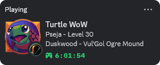

# TurtlePresence
Inspired by [CraftPresence](https://gitlab.com/CDAGaming/CraftPresence-Wow-Edition).
This couldn't be possible without the fantastic [pypresence](https://github.com/qwertyquerty/pypresence) and [SuperWoW](https://github.com/balakethelock/SuperWoW) developers. :green_heart:

---

Enhance how you share your [Turtle WoW](https://turtle-wow.org/) adventures with turtles by integrating with [Discord's Rich Presence API](https://discord.com/developers/docs/rich-presence/overview).

## How to install
- This addon requires addition steps to setup, more info can be found on the [wiki](https://github.com/pseja/TurtlePresence/wiki/How-to-install).

## Why use TurtlePresence?
Whether you're raiding, leveling, or just hanging out in the game world, TurtlePresence adds an extra layer of fun and interaction to your gameplay. Turtles will know what you're up to without even needing to ask, making coordinating and sharing the experience easier.
